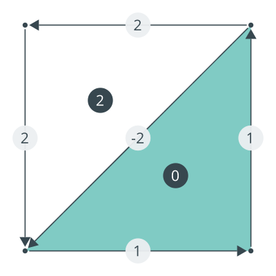

# Myriad
> myriad: synonym, manifold

A library to construct visualizations of manifold theory, geometric algebra,
and related geometric objects.

Currently using diagrams for all 2d plots. Not sure what to use for 3D, when
I'll begin to need 3D plots.

##### a closed discrete differential form that is not exact

